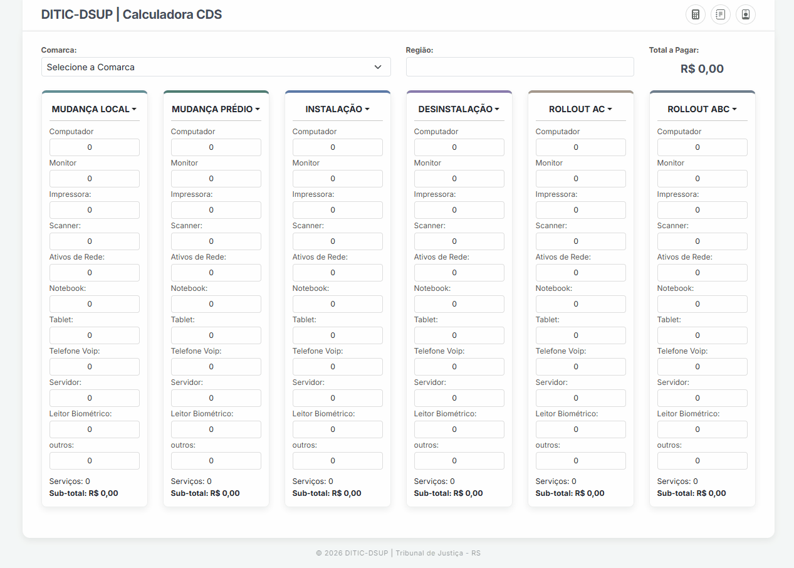
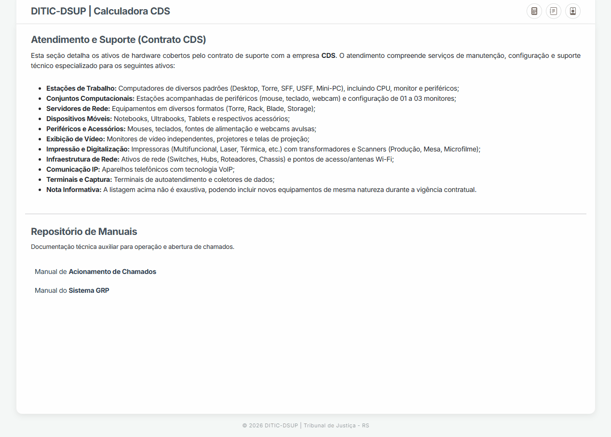
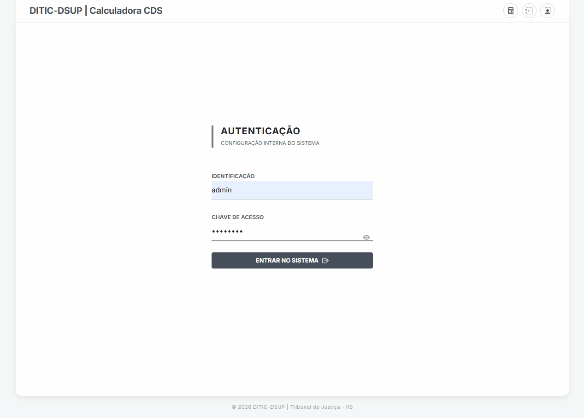

# Sistema de Automação de Faturamento Logístico - TJRS

## Visão geral

Sistema web desenvolvido para resolver um problema real de automatização de cálculos de faturamento de serviços de logística de ativos de TI, sendo utilizado pela Direção de Tecnologia da Informação e Comunicação (DITIC) do Tribunal de Justiça do Rio Grande do Sul (TJRS). O projeto contribuiu para redução de erros manuais e ajudou a aumentar a produtividade da equipe.

O sistema proporciona:

- Maior agilidade no cálculo de faturamento
- Redução de erros operacionais
- Padronização das regras de cálculo
- Facilidade de uso em ambiente institucional

O sistema permanece aplicável independentemente da empresa contratada via licitação.

---

## Autoria

Desenvolvido por Marcelo Diehl  
Estagiário – DITIC/DSUP (2026)

A aplicação foi sugerida e desenvolvida integralmente por Marcelo Diehl, estagiário do DITIC-DSUP (2026), de forma a contribuir com o setor. A propriedade intelectual do código-fonte pertence ao autor, com cessão integral de uso ao Tribunal de Justiça do RS para fins institucionais.

---

## Tecnologias Utilizadas

- Backend: Java 17 com Spring Boot
- Frontend: HTML5, CSS3 (Bootstrap 5.3) e JavaScript
- Banco de Dados: MySQL - SQL Relacional
- Gerenciador de Dependências: Maven

---

## Arquitetura do Sistema

O sistema opera de forma desacoplada:

- Aplicação (.jar): responsável pela lógica de negócio e interface web (Spring Boot com Tomcat embutido)
- Banco de Dados: armazena regiões, comarcas e valores de serviços
- Arquivos externos: manuais armazenados fora da aplicação

Caminho dos manuais:

```
C:/DITIC_DSUP/Manuais/
```

Essa abordagem evita a perda de arquivos em atualizações do sistema.

---

## Estrutura de Diretórios (Produção)

```
C:/DITIC_DSUP/
│
├── dsup-0.0.1-SNAPSHOT.jar
├── server_dsup.bat
└── Manuais/
```

O diretório "Manuais" é criado automaticamente no primeiro uso.

---

## Banco de Dados

Script: dsup_db.sql

### Responsável por:

- Criação do banco de dados
- Estrutura das tabelas
- Inserção de dados iniciais
- Definição dos valores vigentes (2026)

### Configurações:

- Database: dsup_db
- Usuário: dsup_user
- Porta padrão: 3306

---

## Regras de Negócio

### Soma de Itens

Soma simples de todos os ativos e periféricos informados.

### Regra de Monitores

Até 3 monitores por CPU não geram custo adicional. Monitores excedentes são contabilizados conforme a fórmula:

```
(vMon - (vCPU * 3)) / 3
```

### Arredondamento

Os valores finais são arredondados para cima utilizando:

```java
Math.ceil();
```

---

## Segurança e Sessão

### Autenticação

A área administrativa é protegida por login.

### Sessão

A sessão é controlada via sessionStorage e é encerrada automaticamente ao:

- Fechar a aba do navegador
- Recarregar a página
- Encerrar a aplicação

### Usuário padrão

Na primeira execução, o sistema cria automaticamente o usuário:

```
admin
```

Senha inicial:

```
@Ditic26
```

Recomenda-se a alteração após o primeiro acesso.

---

## Execução do Sistema

### Banco de Dados

- Criar o banco dsup_db
- Executar o script dsup_db.sql

### Aplicação

```bash
./mvnw clean package
java -jar target/dsup-0.0.1-SNAPSHOT.jar
```

Ou via script:

```
server_dsup.bat
```

### Acesso

```
http://localhost:8081
```

---

## Manutenção

### Compilação

```bash
./mvnw clean package
```

### Execução

```bash
java -jar dsup-0.0.1-SNAPSHOT.jar
```

---

## Logs

Disponíveis no terminal iniciado pelo arquivo .bat.

---

## Observações

- Sistema projetado para uso em rede local
- Baixa dependência externa
- Estrutura simples e de fácil manutenção

---

## Demonstração

<p align="center">
  
</p>

<p align="center">
  
</p>

<p align="center">
  
</p>

## Licença

Uso institucional – Tribunal de Justiça do Rio Grande do Sul (TJRS)
